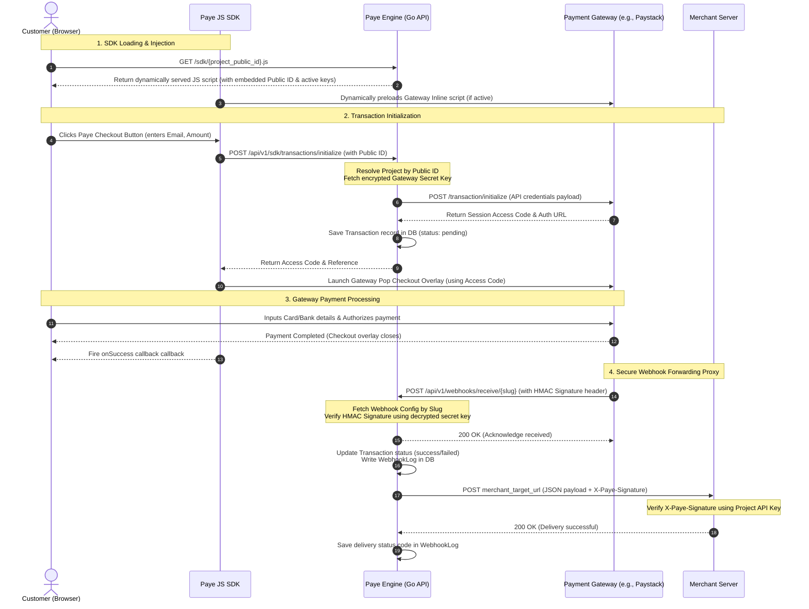

# How Paye Works: Architecture & Design Decisions

Paye acts as a secure, unified middle-layer connecting merchant applications to diverse payment gateway providers (like Paystack or Flutterwave). It handles inline checkouts, scopes credentials, aggregates transaction analytics, and proxies payment gateway webhook alerts back to application servers securely.

---

## System Architecture & Data Flow

Below is a sequence diagram detailing the complete lifecycle of a payment check-out, from loading the client script to the final webhook delivery proxy.



---

## Key Design Decisions

### 1. Multi-Project (Multi-Tenant) Workspaces
* **The Decision**: Rather than scoping provider configs and transaction logs globally to a single `User` account, we introduced the concept of **Projects**.
* **Why**: Modern developers and agencies build multiple applications or manage websites for different clients under a single portal. By scoping webhooks, keys, logs, and configurations to a project, a single merchant user can support multiple completely isolated checkouts under one login.
* **Backward Compatibility**: To prevent breaking existing single-tenant integrations, we implemented a legacy fallback in `VerifyAPIKey` and the `SDKHandler`. If an incoming request uses a legacy user-level credential, Paye automatically creates a "Default Project" matching those credentials on the fly, ensuring zero downtime.

### 2. Publishable Public ID vs. Secret API Key
* **The Decision**: Paye uses two distinct authentication tokens:
  * **Public ID**: Embedded in front-end HTML and JS script requests.
  * **Secret API Key**: Used strictly on backend servers (`X-Paye-API-Key` headers) to verify transactions or query dashboards.
* **Why**: Security isolation. Exposing secret keys on the client side allows malicious users to initialize fraudulent transactions or view dashboard logs. By embedding a randomized `PublicID` (e.g. `paye_pub_test_12345`) in client scripts, front-end scripts can safely identify a project workspace while secret credentials stay hidden.

### 3. Soft-Deletes (`gorm.DeletedAt`)
* **The Decision**: Modified GORM models to use soft-deletes instead of cascading hard-deletes.
* **Why**: Financial compliance and bookkeeping. If a developer accidentally deletes a project or webhook configuration, hard-deleting the database rows would erase all associated historical transaction audit trails. With soft-deletes, deleted records are hidden from active views but preserved internally for transaction audits and financial reconciliation.

### 4. Dynamic Script Loader & SDK Optimization
* **The Decision**: The JS SDK dynamically injects the appropriate gateway pop library (e.g. Paystack's `inline.js`) on the fly rather than bundling gateway libraries together.
* **Why**: Performance and flexibility. Preloading multiple heavy payment scripts slows down merchant landing page load speeds (impacting Core Web Vitals). The Paye SDK only loads a gateway script if the merchant has activated that specific provider in their dashboard, resulting in lightweight, highly performant landing pages.

---

## Connecting to Providers & Encryption

Paye securely integrates with external payment gateways using an encrypted vault approach:

```
[Merchant Inputs Keys] ──> [AES-GCM Encryption] ──> [Stored Encrypted in DB]
                                                           │
                                                           ▼
[API Transaction Request] <── [Decrypted on the fly] <── [Fetch Config from DB]
```

1. **Encryption-at-Rest**: When provider credentials (such as Paystack's secret key) are configured in the dashboard, the keys are encrypted using **AES-256-GCM** key derivation before being saved in PostgreSQL.
2. **On-the-Fly Decryption**: Secret keys are never stored plain-text in the database. Paye fetches and decrypts them only in memory when initializing a payment session or verifying webhook payloads.
3. **HMAC Hook Verification**: Incoming webhooks from payment gateways are signed with cryptographic signatures (e.g., Paystack's `X-Paystack-Signature` using SHA512). Paye calculates the expected signature locally using the decrypted provider secret key to guarantee that the request originated from the official payment gateway before proxying it.
